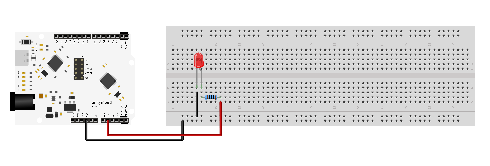

# N32G031_LED_BLINK 

An introductory project designed to teach basic GPIO (General Purpose Input/Output) control using the **N32G031** microcontroller. This "Hello World" of hardware serves as an excellent foundational learning tool for beginners and students to understand digital outputs, basic circuit wiring, and timing functions.

---

## Learning Points
* **Digital Outputs:** Understand the concepts of HIGH (ON) and LOW (OFF) states in digital electronics.
* **Basic Electronics:** Gain hands-on experience using a breadboard, understanding LED polarity (Anode/Cathode), and the importance of current-limiting resistors.
* **Timing & Delays:** Visualize how code execution speed affects physical hardware and how to use delay functions to create visible blinking patterns.

---

## Wiring

The connections between the N32G031 board, the LED, and the resistor are as follows:

| Component | N32G031 Pin | Description |
| :--- | :---: | :--- |
| 🖤 **LED Cathode (Short Leg)** | **GND** | Connected via the negative rail (Black wire) |
| ❤️ **LED Anode (Long Leg)** | **PA1** | Connected via a resistor (Red wire to control signal) |

---

## Hardware Setup & Precautions
When setting up your first LED circuit, please keep the following in mind:
* **LED Polarity:** LEDs only allow current to flow in one direction. Ensure the longer leg (Anode) connects to the signal pin (PA1) and the shorter leg (Cathode) connects to Ground (GND).
* **Use a Resistor:** Always use a current-limiting resistor (e.g., 220Ω or 330Ω) in series with the LED. Connecting an LED directly to the signal pin without a resistor can draw excessive current and damage the LED or the microcontroller.

---

## Code Execution Sequence
Once powered on and flashed with the code, the microcontroller will execute the following loop continuously:
1. Set PA1 to **HIGH** (LED turns ON).
2. Hold this state for **1 second** (1000 ms).
3. Set PA1 to **LOW** (LED turns OFF).
4. Hold this state for **1 second** (1000 ms), then restart the cycle.

---

## Creative Extension Ideas for Students
* **The Speed Challenge:** Encourage students to modify the delay times inside the code.
  * What happens if they change the delay to `100` milliseconds? Does it look like a strobe light?
  * What happens if the ON time is `100` but the OFF time is `2000`?
* **Heartbeat Effect:** Can they write a sequence of delays to make the LED blink like a human heartbeat (ba-bum... ba-bum...)?

---
Developed by **GRB-UNITYMBED** to deliver highly accessible, engaging, and comprehensive coding and robotics educational materials for everyone. 🚀
